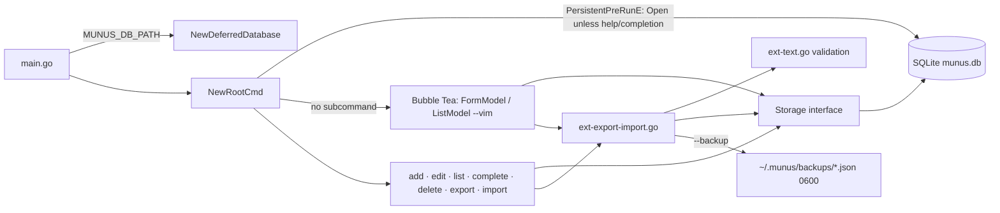
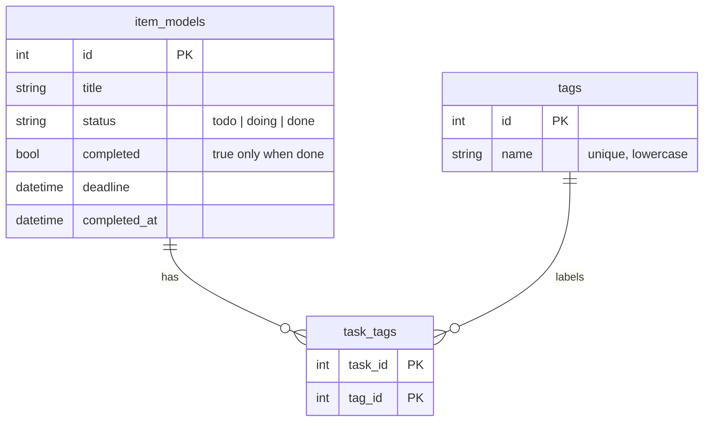

# Repository Map

```
Munus/
├── main.go                 # entry: deferred DB, version stamp, run root cobra command
├── database_path.go        # MUNUS_DB_PATH env → DB path (default ./munus.db)
├── internal/
│   ├── database.go         # Storage interface, gorm Database (lazy open, migration, tags, triggers), shared types
│   ├── logic-cli.go        # cobra commands (root/TUI, add, edit, list, complete, delete, export, import)
│   ├── logic-tui.go        # status transitions, deadline labels, filters, overdue/upcoming helpers
│   ├── ext-deadline.go     # ParseDeadline: absolute + bounded relative (m,h,d,w,M)
│   ├── ext-text.go         # text limits, control-char/UTF-8 validation, tag rules, terminal sanitising
│   ├── ext-export-import.go# JSON v2 export, import (v1/v2, file or stdin) plan/apply, merge, backups
│   ├── ui-form.go          # Bubble Tea task-entry form (insert/normal vim modes)
│   ├── ui-list.go          # Bubble Tea list/dashboard, delete confirm, transfer overlay
│   └── *_test.go           # unit tests per file
├── Dockerfile, .dockerignore # 2-stage CGO build (golang:1.26-alpine3.24 → alpine:3.24, pinned apk), non-root
├── Makefile                # dev targets (build/test/race/cover/vet/fmt/lint/check) + release tagging
├── .github/workflows/      # ci.yml, cd.yml, docker.yml, security.yml (actions SHA-pinned)
├── .devcontainer/          # Ubuntu + Go + neovim + docker-outside-of-docker
├── intel/                  # agent/maintainer knowledge base (this folder)
└── AGENTS.md, README.md, CONTRIBUTING.md, LICENSE, NOTICE, CODEOWNERS
```

## Runtime flow


## Data model
Tags are many-to-many; triggers keep `status` and tag links consistent when an older binary
(v2.1.1) writes to a migrated database.


## CI/CD
| Workflow | Trigger | Does |
|---|---|---|
| `ci.yml` | push/PR any branch | tidy check, vet, golangci-lint, tests+coverage (Linux/macOS/Windows), native CGO build + smoke run |
| `cd.yml` | `v*` tag | per-OS native CGO builds (linux amd64/arm64 static, darwin arm64/amd64, windows amd64, windows arm64 via pinned llvm-mingw) + smoke run → package, checksums, GitHub Release (only release job has `contents: write`) |
| `docker.yml` | push/PR to main | build image, `--help` and DB-on-volume smoke tests |
| `security.yml` | push/PR + weekly | CodeQL (security-extended), gosec (non-failing) with SARIF upload |
