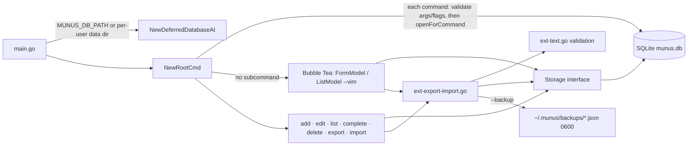
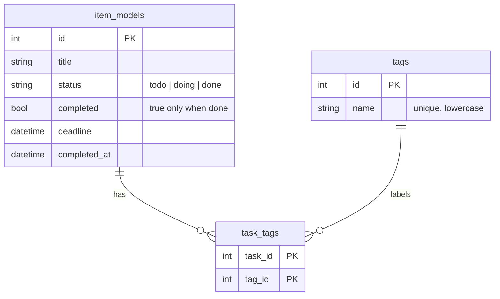

# Repository Map

```
Munus/
├── main.go                 # entry: deferred DB, version stamp, run root cobra command
├── database_path.go        # DB location: MUNUS_DB_PATH, else munus.db in the per-user data dir; notice for an old ./munus.db
├── internal/
│   ├── database.go         # Storage interface, gorm Database (lazy open, migration, tags, triggers), shared types
│   ├── logic-cli.go        # cobra commands (root/TUI, add, edit, list, complete, delete, export, import)
│   ├── logic-tui.go        # status transitions, deadline labels, filters, overdue/upcoming helpers
│   ├── ext-deadline.go     # ParseDeadline: absolute + bounded relative (m,h,d,w,M)
│   ├── ext-text.go         # text limits, control/bidi-char and UTF-8 validation, tag rules, terminal sanitising (incl. stderr writer)
│   ├── ext-export-import.go# JSON v2 export, import (v1/v2, file or stdin; streaming decode, 50k-task cap) plan/apply, merge, backups
│   ├── ui-form.go          # Bubble Tea task-entry form (insert/normal vim modes)
│   ├── ui-list.go          # Bubble Tea list/dashboard, delete confirm, transfer overlay (import/export steps run as background commands)
│   └── *_test.go           # unit tests per file
├── tools/licenses/         # stdlib-only generator/check for THIRD_PARTY_LICENSES and the NOTICE module list (+ embedded musl COPYRIGHT)
├── THIRD_PARTY_LICENSES    # generated full license texts (Go, SQLite, musl, every compiled module); shipped in archives and image
├── Dockerfile, .dockerignore # CGO build on golang:1.26-alpine3.24 (pinned apk): image (→ alpine:3.24, non-root, license files) and `static` target (musl static Linux release binary)
├── Makefile                # dev targets (build/test/race/cover/vet/fmt/lint/check/fuzz/licenses) + release tagging
├── .github/workflows/      # ci.yml, cd.yml, docker.yml, security.yml (actions SHA-pinned)
├── .github/dependabot.yml  # weekly grouped updates: actions, Go modules, Docker images
├── .github/pull_request_template.md # contributor PR checklist (mirrors CONTRIBUTING.md)
├── .devcontainer/          # Ubuntu + Go + neovim + docker-outside-of-docker
├── intel/                  # agent/maintainer knowledge base (this folder)
└── AGENTS.md, README.md, CONTRIBUTING.md, SECURITY.md, LICENSE, NOTICE, CODEOWNERS
```

## Runtime flow

```mermaid
flowchart LR
  main[main.go] -->|MUNUS_DB_PATH or per-user data dir| deferred[NewDeferredDatabaseAt]
  main --> root[NewRootCmd]
  root -->|each command: validate args/flags, then openForCommand| db[(SQLite munus.db)]
  root -->|no subcommand| tui[Bubble Tea: FormModel / ListModel --vim]
  root --> cli[add · edit · list · complete · delete · export · import]
  tui --> storage[Storage interface]
  cli --> storage
  cli --> xfer[ext-export-import.go]
  tui --> xfer
  xfer --> text[ext-text.go validation]
  xfer --> storage
  xfer -->|--backup| bk[~/.munus/backups/*.json 0600]
  storage --> db
```

## Data model
Tags are many-to-many; triggers keep `status` and tag links consistent when an older binary
(v2.1.1) writes to a migrated database.

```mermaid
erDiagram
  item_models ||--o{ task_tags : "has"
  tags ||--o{ task_tags : "labels"
  item_models {
    int id PK
    string title
    string status "todo | doing | done"
    bool completed "true only when done"
    datetime deadline
    datetime completed_at
  }
  tags {
    int id PK
    string name "unique, lowercase"
  }
  task_tags {
    int task_id PK
    int tag_id PK
  }
```

## CI/CD
| Workflow | Trigger | Does |
|---|---|---|
| `ci.yml` | push/PR any branch | latest Go 1.26.x: tidy check, vet, golangci-lint, tests+coverage incl. the `THIRD_PARTY_LICENSES`/`NOTICE` check (Linux/macOS/Windows), native CGO build + smoke run |
| `cd.yml` | `v*` tag | per-OS/arch native CGO builds: linux amd64/arm64 static musl via the Dockerfile `static` target (smoke-run also on Debian 11 and Alpine), darwin arm64 and amd64 (`macos-15-intel`), windows amd64 and arm64 (pinned llvm-mingw), others with latest Go 1.26.x and no build cache → archives with `LICENSE`/`NOTICE`/`THIRD_PARTY_LICENSES`, checksums, build provenance attestation, GitHub Release (the package/attest job has `contents: read` plus OIDC; only the tag-only publishing job has `contents: write`) |
| `docker.yml` | push/PR to main | build image, `--help`, DB-on-volume, `TZ`, license-file and thread-stack checks; static Linux binary (amd64, arm64) built and run on the runner, Debian 11 and Alpine |
| `security.yml` | push/PR + weekly | CodeQL (security-extended), gosec (non-failing) with SARIF upload, govulncheck (fails on reachable vulnerabilities) |
